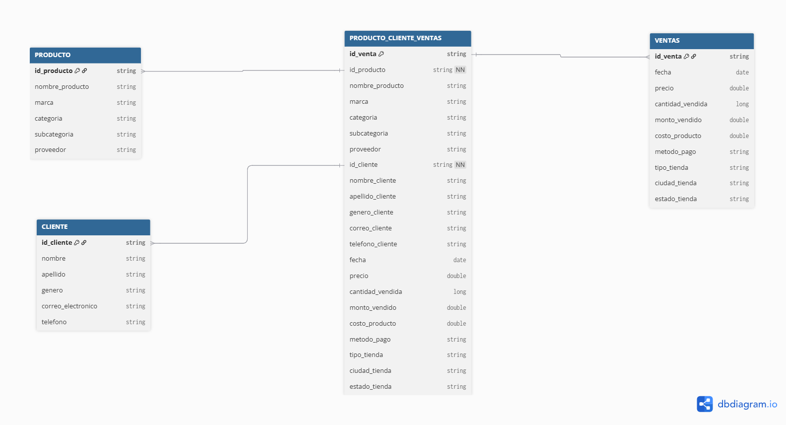
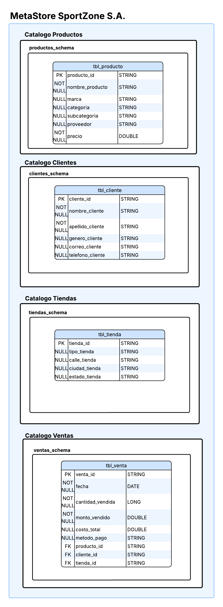

# 🚀 Portafolio de Big Data: Caso SportZone
# 🟦 Evidencia de Aprendizaje 1 — Creación de Base de Datos Analítica
Databricks | SQL | Unity Catalog
## 👥 Integrantes

- Jorge Armando Rodriguez

- Lina Johana Seguro Gaviria

## 🧩 Problemática Abordada

La empresa **SportZone S.A.**, dedicada a la venta de artículos de fútbol, tiene información dispersa sobre ventas, productos, tiendas y clientes.
El objetivo es construir una base de datos analítica centralizada dentro de Databricks, utilizando SQL con Unity Catalog.

## 🎯 Objetivo del Proyecto

Crear una base de datos analítica que:

- Centralice el historial de ventas

- Organice los datos correctamente

- Garantice consistencia e integridad


## 📊 Dataset Utilizado

Incluye información de:

- Identificadores de venta

- Productos

- Tiendas

- Ciudades

- Categorías

- Montos

- Fechas

## 🏗️ Desarrollo de la Actividad 1
### 1️⃣ Conteo de Registros
``` SELECT COUNT(*) FROM tbl_ventas;```

### 2️⃣ Estructura de la Tabla
``` DESCRIBE TABLE tbl_ventas;```

### 3️⃣ Consulta con Filtro (Ventas en Miami)
```SELECT * FROM tbl_ventas 
 WHERE ciudad = 'Miami' 
LIMIT 10;
```
### 📐 Modelo Entidad-Relación (ERD)
Diagrama diseñado para visualizar las relaciones entre las tablas de la base de datos:

<p align="center">
  
</p>

## 📂 Estructura del Repositorio (Actividad 1)
```
📂 BIGDATA/
├── 📂 Actividad_1/
│   ├── 🖼️ ERD.png
│   ├── 📓 Rodriguez_Jorge_Seguro_Lina_Actividad_1.ipynb
│   └── 🖼️ VR.png
├── ⚙️ .gitignore
└── 📄 README.md
```

## 🧠 Conclusiones (Actividad 1)

- Se creó una base analítica funcional.

- Las consultas confirmaron la correcta carga de datos.

- La tabla presenta estructura adecuada para análisis posteriores.

# 🟩 Evidencia de Aprendizaje 2 — Procesamiento de Datos en la Nube
Databricks | Spark | SQL | Unity Catalog
## 👥 Autores

- Jorge Armando Rodriguez

- Lina Johana Seguro Gaviria

## 🚀 Descripción del Proyecto

Este proyecto implementa un flujo completo de:

- Ingesta de datos

- Procesamiento con Spark

- Validación técnica

- Consultas SQL

- Persistencia en Delta Tables

- Gestión usando Unity Catalog

## 🏗️ Arquitectura del Proyecto
### 🔹 Flujo General del Notebook

- Diseño del esquema

- Creación de tablas

- Ingesta desde Kaggle + carga manual

- Validación de metadatos

- Consultas con SQL y Spark


## 🧩 1. Diseño del Esquema

a. Descripción del Dataset

Dataset de ventas de equipamiento de fútbol que contiene información sobre:

- Transacciones

- Productos

- Clientes

- Tiendas

Incluye características como precios, cantidades, ubicación y detalles de clientes.

b. Esquema SportZone

Diagrama  Unity Catalog utilizado en el proyecto:

<p align="center">
  
</p>

c. DDL del Esquema (Spark SQL)

El proyecto incluye un archivo SQL con la definición de todas las tablas:

📄 DDL.sql

[Archivo DDL.sql](./DDL.sql)


## 🔧 2. CONFIGURACIÓN DE DATABRICKS
### 🚀 Creación y Configuración del Cluster

Parámetros usados:

- Runtime 15.4 LTS

- Python 3.10

- Autoscaling

- 4 vCPU / 16GB RAM

b. Verificación de Versiones

El notebook imprime:

- spark.version

- sys.version

c. Estructura de Almacenamiento

Se usan:

📁 Unity Catalog → Catálogo + Schema

📁 Volumes → Ruta por defecto

📁 DBFS → ```/Volumes/sportzone/ventas_schema/vol_ventas/```

d. Obtención de Datos de Kaggle

Incluye:

- Configuración de credenciales

- Funciones para descargar datasets

- Extracción y lectura del CSV

- Conversión de Pandas → Spark DataFrame

## 📥 3. Ingesta del Dataset
### ✔ 3.1 Carga manual del CSV

Archivo CSV cargado a Volumes.

### ✔ 3.2 Lectura con Spark
``` spark.read.csv(path, header=True, inferSchema=True)```

### ✔ 3.3 Persistencia

- Tabla temporal

- Tabla administrada en Unity Catalog

- Tabla Delta final tbl_venta

## 🔍 4. Validaciones y Análisis
### 📊 4.1 Metadatos

- ```DESCRIBE TABLE```

- ```DESCRIBE DETAIL```

- ```SHOW CREATE TABLE```

### 🧮 4.2 Estadística descriptiva

- Comparación SQL vs Spark.

### 📈 4.3 Consultas analíticas

Se ejecutaron consultas para:

- Ventas por producto

- Cantidad de productos distintos

- Agregaciones básicas (SUM, COUNT, AVG)

Con versiones en:

  -  ✔ SQL

   - ✔ Spark

### 🔢 4.4 Conteos y Muestras

Incluye:

- ```COUNT(*)```

- ```SELECT * LIMIT n```

- Exploración inicial del dataset

## ⚡ 5. SQL VS SPARK: Ventajas y Desventajas

🔵 Spark

- Procesamiento distribuido

- Ideal para volúmenes grandes

- Mejor rendimiento en ETL

🟢 SQL

- Más simple para analítica

- Fácil de entender y mantener

- Más declarativo

## ▶️ Cómo Ejecutar el Proyecto

1. Clonar repositorio

2. Crear cluster

3. Crear catálogo + schema

4. Crear Volume

5. Subir CSV

6. Ejecutar notebook

## 📂 Estructura del Repositorio (Actividad 2)
```
📂 BIGDATA/
├── 📂 Actividad_2/
│   ├── 🖼️ 1.png
│   ├── 🖼️ 2.png
│   ├── 🖼️ 3.png
│   ├── 🖼️ 4.png
│   ├── 💾 DDL.sql
│   ├── 🖼️ Esquema.png
│   ├── 📓 Rodriguez_Jorge_Seguro_Lina_Actividad_2.ipynb
│   └── 🖼️ VD.png
├── ⚙️ .gitignore
└── 📄 README.md
```

## 🧠 Conclusiones (Actividad 2)

- Se completó un flujo profesional de ingesta y análisis.

- Los datos quedaron en formato Delta optimizado.

- Spark y SQL demostraron complementariedad.

- Unity Catalog aseguró control de datos.

# 👥 Autores Finales

✨ Jorge Armando Rodriguez

✨ Lina Johana Seguro Gaviria